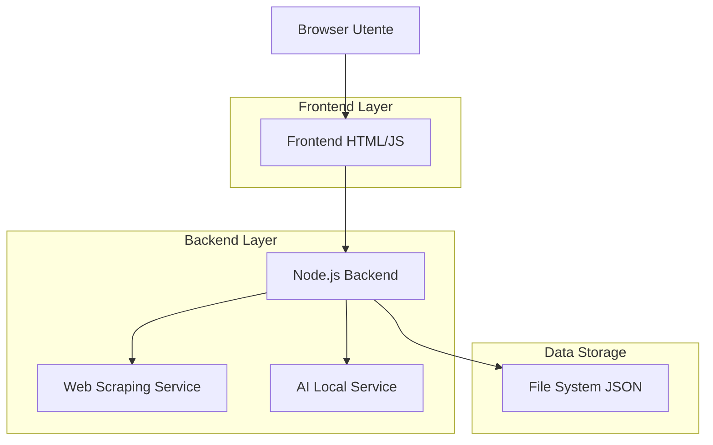

## 1. Architettura Design

## 2. Descrizione Tecnologie

- Frontend: HTML5 + Vanilla JavaScript ES6+ + CSS3
- Backend: Node.js 18+ con Express.js 4
- Web Scraping: Puppeteer 19+ o Cheerio 1+
- AI Locale: Ollama con modello Llama 2 o similare
- Storage: File System JSON locale
- Initialization Tool: npm init

## 3. Definizione Route

| Route | Scopo |
|-------|--------|
| GET / | Homepage con gestione URL |
| GET /api/urls | Recupera lista URL salvati |
| POST /api/urls | Salva nuova lista URL |
| POST /api/process | Avvia elaborazione articoli |
| GET /api/status | Stato elaborazione in corso |
| GET /api/results | Recupera risultati analisi |
| GET /api/download | Download JSON risultati |

## 4.