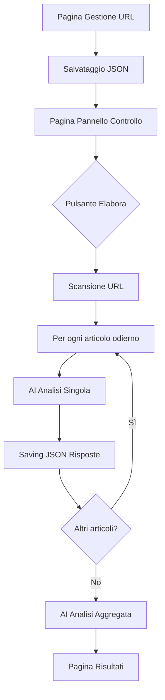

## 1. Panoramica del Prodotto
Strumento web per la raccolta e analisi automatica di articoli online tramite intelligenza artificiale locale. Consente di gestire un elenco di URL, verificare la presenza di articoli aggiornati oggi, analizzarli con AI e produrre un report aggregato.

Il prodotto risolve il problema del monitoraggio tempo reale di multiple fonti editoriali, automatizzando l'estrazione e l'analisi dei contenuti per utenti che necessitano di sintesi intelligenti da più sorgenti web.

## 2. Funzionalità Principali

### 2.1 Ruoli Utente
| Ruolo | Metodo di Accesso | Permessi Core |
|------|-------------------|---------------|
| Utente Standard | Accesso diretto alla web app | Gestione URL, avvio elaborazioni, visualizzazione risultati |

### 2.2 Modulo Funzionalità
L'applicazione consiste nelle seguenti pagine principali:
1. **Gestione URL**: Interfaccia per inserire, modificare, eliminare e ordinare la lista di URL da monitorare
2. **Pannello Controllo**: Dashboard con stato elaborazione e pulsante "Elabora"
3. **Risultati Analisi**: Visualizzazione tabellare dei risultati AI e report aggregato

### 2.3 Dettagli Pagina
| Nome Pagina | Modulo Nome | Descrizione Funzionalità |
|-------------|-------------|-------------------------|
| Gestione URL | Form Inserimento | Inserimento nuovo URL con validazione formato |
| Gestione URL | Lista URL | Visualizzazione lista con possibilità di edit inline, eliminazione singola o multipla, drag&drop per riordinamento |
| Gestione URL | Salvataggio Automatico | Auto-salvataggio modifiche in JSON locale |
| Pannello Controllo | Stato Sistema | Indicatore stato (pronto/in elaborazione/completato), contatore URL configurati |
| Pannello Controllo | Avvio Elaborazione | Pulsante "Elabora" con conferma, progress bar durante elaborazione |
| Risultati Analisi | Tabella Risultati | Tabella con articoli trovati: URL sorgente, titolo, data, punteggio AI |
| Risultati Analisi | Report Aggregato | Tabella sintesi finale generata dall'analisi AI di tutti i risultati |
| Risultati Analisi | Esportazione | Download JSON risultati e report aggregato |

## 3. Processo Core
Flusso operativo principale:
1. Utente configura lista URL nella pagina di gestione
2. Sistema salva configurazione in JSON locale
3. Utente avvia elaborazione dal pannello controllo
4. Sistema scansiona ogni URL per articoli con data odierna (00:00 - ora corrente)
5. Ogni articolo viene processato da AI locale con prompt preconfigurato
6. Risultati individuali salvati in JSON risposte
7. JSON risposte processato da AI per generare tabella aggregata
8. Risultati finali presentati all'utente

## 4. Interfaccia Utente

### 4.1 Stile Design
- Colori primari: Blu scuro (#1a365d) e bianco
- Colori secondari: Grigio chiaro (#f7fafc) e verde successo (#38a169)
- Stile bottoni: Pulsanti rettangolari con angoli arrotondati (border-radius: 8px)
- Font: System-ui, font-size base 16px
- Layout: Card-based con ombreggiature leggere
- Icone: Emoji native per azioni (🗑️ elimina, ✏️ modifica, 📋 lista)

### 4.2 Panoramica Design Pagine
| Nome Pagina | Modulo Nome | Elementi UI |
|-------------|-------------|-----------|
| Gestione URL | Form Inserimento | Input field larghezza 100%, placeholder "Inserisci URL...", bottone "Aggiungi" verde |
| Gestione URL | Lista URL | Cards orizzontali per ogni URL, con icone modifica/elimina, drag handle per riordino |
| Pannello Controllo | Stato Sistema | Card centrale con indicatori numerici, progress bar orizzontale |
| Pannello Controllo | Avvio Elaborazione | Pulsante "Elabora" grande e prominente, colore blu primario |
| Risultati Analisi | Tabella Risultati | Tabella scrollabile con header fissi, righe alternate colorate |
| Risultati Analisi | Report Aggregato | Card separata con tabella sintesi, highlight righe importanti |

### 4.3 Responsività
Design desktop-first con adattamento mobile. Su dispositivi mobili: layout single-column, menu hamburger, tabelle scrollabili orizzontalmente. Touch-optimized con bottoni grandi almeno 44px.